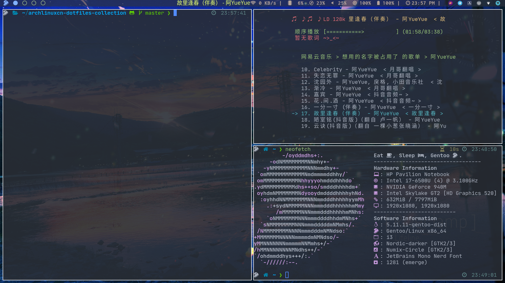
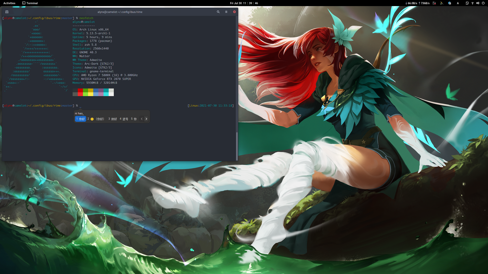
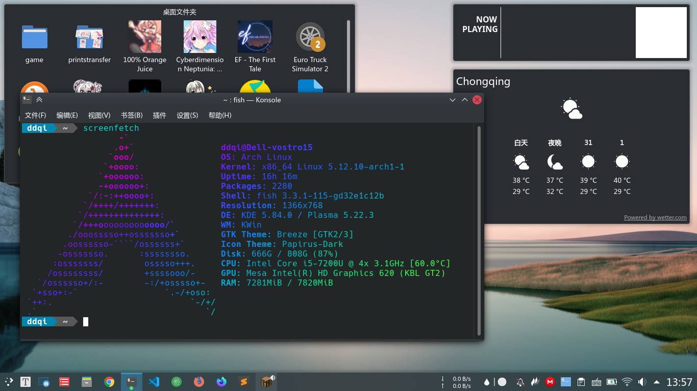
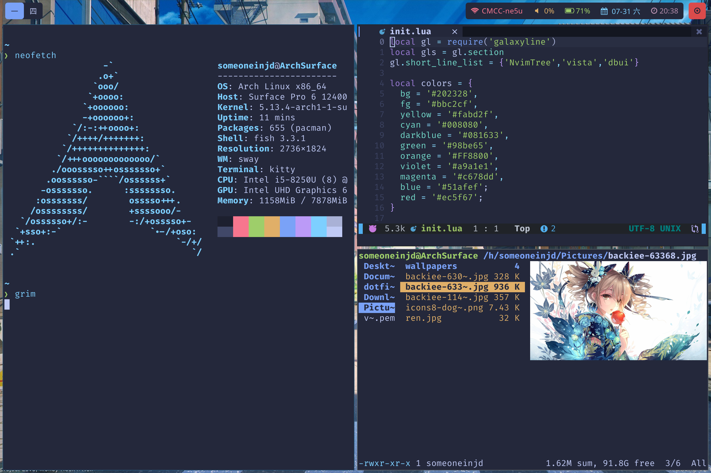
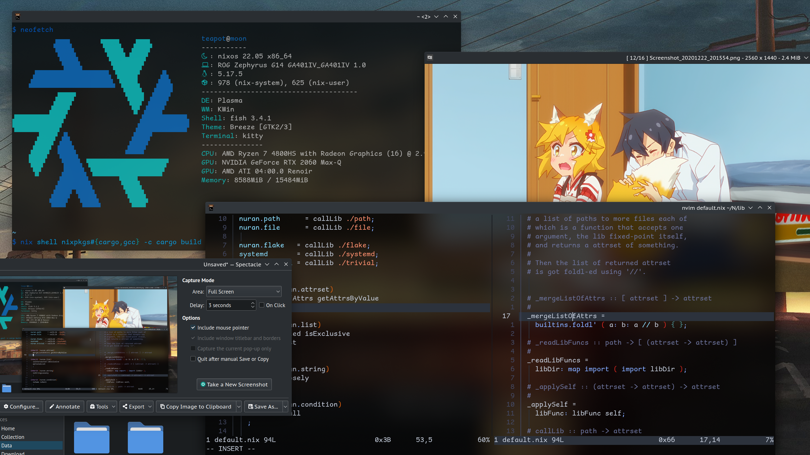
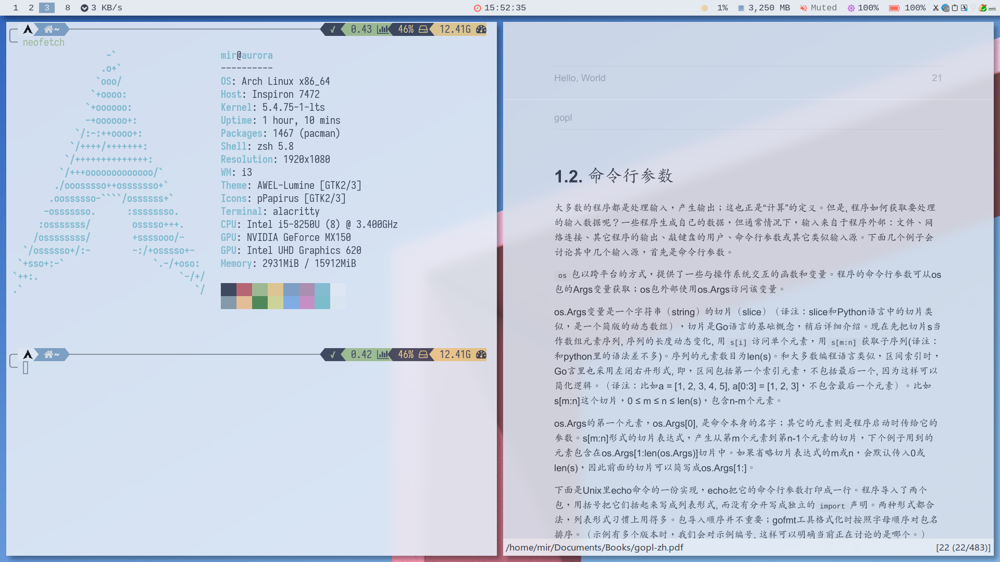

# archlinuxcn-dotfiles-collection

本仓库为收集热爱 Linux 定制的用户 dotfiles 而生！

贡献要求：

- 提供一张具有代表性的桌面截图（可选）
- 提供 dotfiles 源仓库链接
- 没有任何桌面与窗口管理器限制
- 对发行版不做限制，虽然目前参与者大多是 archlinux 用户

## dotfiles 列表

以下排名不分先后

- [zjuyk-archlinux](https://github.com/zjuyk/dotfiles)

- [zjuyk-gentoo](https://gitlab.com/zjuyk/gentoo-dotfiles)

- [tonyfettes-archlinux](https://github.com/tonyfettes/dotfiles)

- [rocka-archlinux](https://github.com/rocka/dotFiles)

- [farseerfc-archlinux](https://github.com/farseerfc/dotfiles)

- [liolok-archlinux](https://github.com/liolok/dotfiles)

- [axionl-archlinux](https://github.com/axionl/dotfiles)

- [lilydjwg-dotvim](https://github.com/lilydjwg/dotvim)

- [lilydjwg-dotzsh](https://github.com/lilydjwg/dotzsh)

- [NickCao-nixos](https://gitlab.com/NickCao/flakes)

- [AlynxZhou-zsh](https://github.com/AlynxZhou/alynx-zsh-config)

- [AlynxZhou-rime](https://github.com/AlynxZhou/alynx-rime-config)

- [ShadowRZ-nixos](https://github.com/ShadowRZ/flakes)

- [weearc-archlinux](https://github.com/weearc/dotfile)

- [someoneinjd-archlinux](https://github.com/someoneinjd/dotfiles)

- [MidAutumnMoon-.files](https://github.com/MidAutumnMoon/MidAutumnMoon)

- [bspwm-nord-dracula-bigsur](https://github.com/ayamir/bspwm-dotfiles)

- [i3-arch](https://github.com/ayamir/i3-dotfiles)

- [nord-and-light](https://github.com/ayamir/nord-and-light)

- [dwm-arch](https://github.com/ayamir/dwm-dotfiles)

- [Coelacanthus-dot](https://github.com/CoelacanthusHex/dotfiles)
